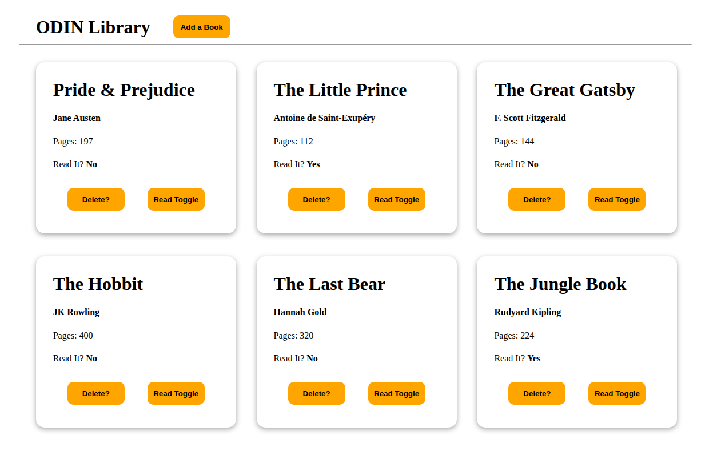

# ODIN - Javascript Course
## Project: ODIN Library Solution

This is a solution to the [Project: ODIN Library Solution from The ODIN Project](https://www.theodinproject.com/lessons/node-path-javascript-library).
## Table of contents

- [Overview](#overview)
  - [Screenshot](#screenshot)
  - [Links](#links)
- [My process](#my-process)
  - [Built with](#built-with)
  - [What I learned](#what-i-learned)
  - [Continued development](#continued-development)
- [Author](#author)

## Overview

### Screenshot

### Links

- Live Site URL: [https://caylemh.github.io/odin-library/](https://caylemh.github.io/odin-library/){:target="_blank"}

## My process

- I first began with the HTML skeleton for the project and then proceeded to implement the CSS styles for the final look and outcome.
- Basic functionality for Javascript functionality was added, ie. CRUD functions.

### Built with

- Semantic HTML5 markup
- Vanilla CSS
- CSS custom properties
- Desktop-first workflow
- Javascript (Objects and Object Constructors)

### What I learned

- Using HTML, CSS Grid and Flexbox where applicable to create an efficient dashboard design.
- Used CSS Grid to create a dynamic layout for the cards.
- Used Javascript objects and object contructors to crea better program flow and readability.

## Author

- Frontend Mentor - [@caylemh](https://www.frontendmentor.io/profile/caylemh)
- Github Profile - [@caylemh](https://www.frontendmentor.io/profile/caylemh)